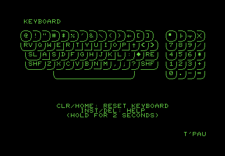
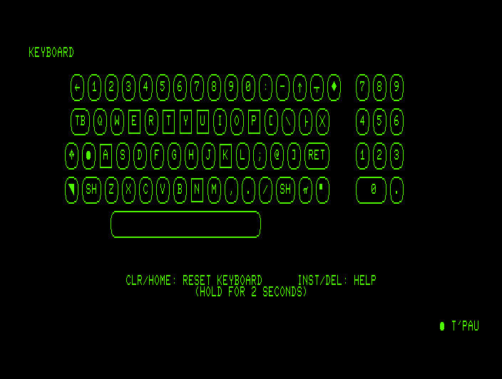

# Anykey for Commodore PET

The programs are provided as disk images in `D64` and `D81` format, which also contain a loader program. They are also provided separately in `PRG` format.

## Supported Models

### Anykey PET 8k

This version requires at least 8k RAM and supports only 40 columns mode and calculator or graphics style keyboards. 

- PET 2001 with at least 8k RAM
- CBM 3008
- CBM 3016
- CBM 3032

### Anykey PET Full

This version requires at least 16k RAM and supports 40 and 80 columns modes and all keyboard types.

- CBM 2001
- CBM 3016
- CBM 3032
- CBM 4016
- CBM 4032
- CBM 8032
- CBM 8096
- CBM 8296
- PET 4016
- PET 4032
- Tynemouth Mini PET 40/80

## Loading the Program

The disc image contains a BASIC loader that detects which machine it runs on and automatically loads the correct program. Load it with `LOAD"*",8` and start it with `RUN`.

## The Keyboard Window

The keys are displayed in the same layout as the physical keyboard.

Keys that are currently pressed are displayed inverted.

Keys that were previously pressed are displayed with a square frame. This helps detect dead keys. To reset the state of all keys to unpressed, hold `Clr/Home` for two seconds.

## Keyboard Types

### Calculator Keyboard

This keyboard was used in the earliest pet models and in the Tynemouth Mini PET 40/80. keys are arranged in a rectangular grid.

### Graphics Keyboard

This keyboard was used in some models with 40 column displays. It features the graphics character on the front of the key caps and a 4x5 number block.

### Business Keyboard

This keyboard was used in later models with 40 column and all models with 80 column displays. It features digit keys on the main keyboard and a 3x4 number block.

## Key Labels

Most keys are labeled with the symbol they produce when pressed without shift. Special keys are labeled with a short description or graphics symbol, depending on the space available:

- Clear/Home: `▘`, `CLR`
- Cursor Left/Right: `┳`, `<=>`
- Cursor Up/Down: `┣`, `U/D`
- Escape: `♣`, `ESC`
- Insert/Delete: `╳`, `DEL`
- Repeat: `π`
- Return: `RE`, `RET`
- Reverse On/Off: `◥`, `RV`
- Run/Stop: `◆`, `R/S`
- Shift: `○`, `SH`, `SHF`, `SHFT`
- Shift Lock: `●`, `SL`
- Tab: `TB`

## Special Keys

`Shift Lock` and the left `Shift` key appear as the same key to the computer and cannot be reliably distinguished on all computers.

## Technical Limitations

If you press certain combinations of three keys, a fourth key will also appear pressed. This is because the three keys together create the same electrical connection the fourth key would.
