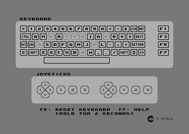
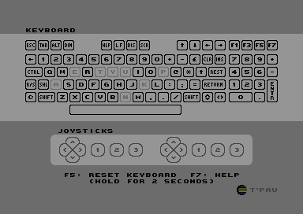
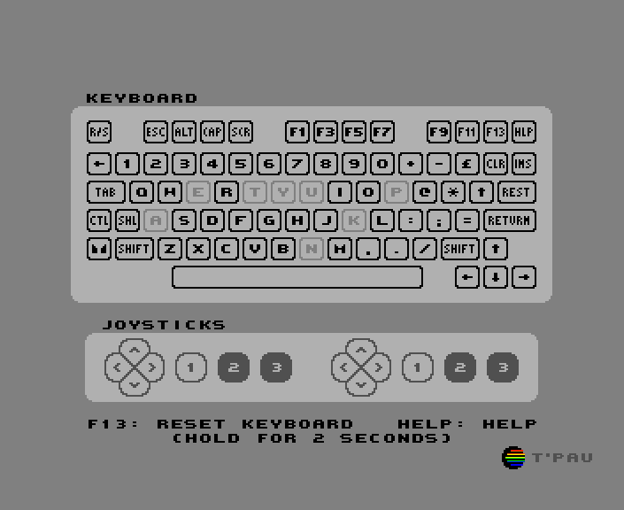
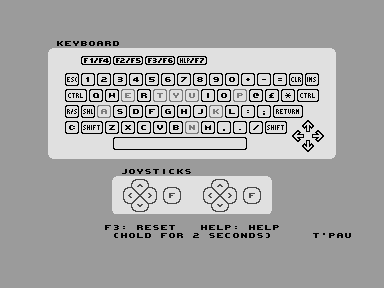
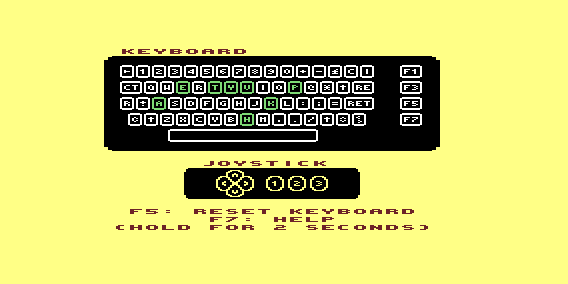

# Anykey for Commodore 8-Bit Computers (and MEGA65)

There is a separate page for [Commodore PET](Anykey%20Commodore%20PET.md).

The programs are provided as disk images in `D64` and `D81` format, which also contain a loader program. They are also provided separately in `PRG` format.

## Supported Models

### Anykey C64

- Commodore 64
- Commodore 128 (in C64 mode, PAL only)
- MEGA65 (in C64 mode)

### Anykey C128

- Commodore 128 (in C128 40 columns mode)

### Anykey MEGA65

- MEGA65 (in native mode)
  
### Anykey Plus/4

- Commodore Plus/4

### Anykey VIC-20

- Commodore VIC-20 (at least 8k RAM expansion)

## Loading the Program

The disc image contains a BASIC loader that detects which machine it runs on and automatically loads the correct program. For this to work on systems other than the C64, you need to load it with `LOAD"*",8` and start it with `RUN`. Loading it with `LOAD"*",8,1` will not work. On C128 and MEGA65, the disk will auto-boot: simply insert the disk and turn on the computer.

## The Keyboard Window

The keys are displayed in the same layout as the physical keyboard.

Keys that are currently pressed are displayed inverted.

Keys that were previously pressed are displayed in a darker gray. This helps detect dead keys. To reset the state of all keys to unpressed, hold the key indicated on screen for two seconds. (`F5` on C64 and C128, `F13` on MEGA65, `F3` on Plus/4)

## The Joysticks Window

Joysticks contain a stick or d-pad with switches for the four cardinal directions and up to three buttons.

Pressed directions and buttons are displayed inverted.

Buttons 2 and 3 bring an analog potentiometer to a low value by connecting its pin to +5V. These potentiometers are also used by paddles and the 1351 mouse; if such a device is connected, the buttons may read as pressed.

Plus/4 does not support more than one button.

## Model Specific Notes

### Commodore 128

When run in C64 mode on a C128, Anykey will display and test the full C128 keyboard. However, the `40/80 Display` key cannot be read in C64 mode, therefore it is displayed grayed out. To test it, use the native version, Anykey 128.

In C128 mode, Anykey will always display on the 40 columns (VIC) display, even if started from 80 columns mode.

### MEGA65

When run in C64 mode on a MEGA65, Anykey will display and test the full MEGA65 keyboard.

### VIC-20

Most keys are labeled with the symbol they produce when pressed without shift. Special keys are labeled with a short description or graphics symbol:

- Clear/Home: `C`
- Cursor Left/Right: `<>`
- Cursor Up/Down: `^v`
- Insert/Delete: `I`
- Restore: `RE`
- Return: `RET`
- Run/Stop: `R`
- Shift: `⇧`
- Shift Lock: `⇪`

## Special Keys

`Shift Lock` and the left `Shift` key, and on Plus/4 also the right `Shift` key, appear as the same key to the computer and cannot be reliably distinguished on all computers. On Plus/4, both `Control` keys also appear as the same key.

The `Restore` key cannot be read directly. Anykey can detect when the key is pressed, but it can't detect for how long, is it assumes the key was released after a short while.

On MEGA65, when pressing `Cursor Up` or `Cursor Left`, `Right Shift` and the opposite cursor keys also appear pressed to software to maintain compatibility with C64. To avoid prematurely marking keys as pressed, these keys are disabled while `Cursor Up` or `Cursor Left` is pressed. 

## Technical Limitations

If you press certain combinations of three keys, a fourth key will also appear pressed. This is because the three keys together create the same electrical connection the fourth key would.

On C64 and C128, joysticks interfere with reading the keyboard. When a joystick is pressed, certain keys can't be read. These keys will be ignored while the joystick is pressed. If such a key was pressed before the joystick, it will remain pressed until the joystick is released. Auto fire might defeat this detection and result in phantom key presses.          
