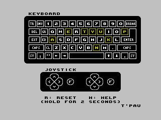
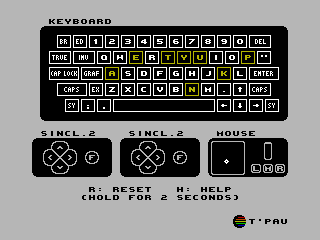

# Anykey for Sinclair ZX-Spectrum

The programs are provided as tape images in `TAP` and `TZX` formats.

## Supported Models

There are five versions of Anykey for the various ZX Spectrum models to account for the different keyboard types:

### Anykey Spectrum 48k

  - original ZX Spectrum 48k with rubber keyboard

### Anykey Spectrum 48k+ / 128k

- ZX Spectrum 48k+
- ZX Spectrum 128k

### Anykey Spectrum +2 / +3

- ZX Spectrum +2 (gray model, made by Sinclair)
- ZX Spectrum +2A (black model, made by Amstrad)
- ZX Spectrum +3

### Anykey Spectrum Next

- ZX Spectrum Next

### Anykey Spectrum N-Go

- N-Go (ZX Spectrum Next clone)

## Loading the Program

Insert the tape and enter `LOAD ""` by pressing `J` and `Symbol-P` twice. Then press `Enter` and the play button on the tape deck.

## The Keyboard Window

The keys are displayed in the same layout as the physical keyboard.

Keys that are currently pressed are displayed inverted.

Keys that were previously pressed are displayed in yellow. This helps detect dead keys. To reset the state of all keys to unpressed, hold `9` for two seconds.

## The Joysticks Window

Joysticks contain a stick or d-pad with switches for the four cardinal directions and up to four button.

Pressed directions and buttons are displayed inverted.

The +2 and +3 has two joystick ports, Sinclair 1 and Sinclair 2. Joystick movement is seen by the computer as key presses. Sinclair 1 uses the keys 6-0, Sinclair 2 the keys 1-5.

On Next and N-Go, there are two physical joystick ports. The user can configure each as any supported type:
- Sinclair (1 button)
- Kempston (2 buttons)
- Megadrive (3 buttons, start)
- Cursor (1 button)
- Keyjoy (2 buttons)

The Keyjoy joystick can be configured to arbitrary keys by the user, only the default configuration is supported.

The left window displays joystick in port 1, the middle window port 2.

## Mouse

The right window the PS/2 mouse. It supports X/Y position, three buttons and a scroll wheel.

## Special Keys

On 48k+, 128k, +2, and +3 models all keys except for digits, letters, `Space`, `Enter`, `Caps Shift` and `Symbol Shift` are read by the computer as two key presses.

The computer can't tell if such a key or the two corresponding keys are pressed, so Anykey displays all three as pressed.

For best results, test the normal keys first.

## Technical Limitations

If you press certain combinations of three keys, a fourth key will also appear pressed. This is because the three keys together create the same electrical connection the fourth key would.
