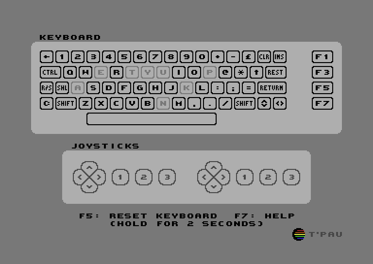

# Anykey

This program monitors the keyboard and joysticks.

The upper window shows the state of the keyboard.

The lower window shows the state of two joysticks connected to the controller ports.

To test other controller types or joystick adapters, please use the companion program [Joyride](https://github.com/T-Pau/Joyride).

## Keyboard

The keys are displayed in the same layout as the physical keyboard.

Keys that are currently pressed are displayed inverted.

Keys that were previously pressed are displayed in a lighter gray. This helps detect dead keys. To reset the state of all keys to unpressed, hold `F5` for two seconds.

## Joysticks

Joysticks contain a stick or d-pad with switches for the four cardinal directions and up to three buttons.

Pressed directions and buttons are displayed inverted.

Buttons 2 and 3 bring an analog potentiometer to a low value by connecting its pin to +5V.
	

## Special Keys

`Shift Lock` and the left `Shift` key appear as the same key to the computer and cannot be reliably distinguished on all computers.
	
The `Restore` key cannot be read directly. Anykey can detect when the key is pressed, but it can't detect for how long.

## Commodore 128

When run in C64 mode on a C128, Anykey will display and test the full C128 keyboard.

The `40/80 Display` key cannot be read in C64 mode, therefore it is displayed greyed out. To test it, use the native version, Anykey 128.

## Technical Limitations

Joysticks interfere with reading the keyboard. When a joystick is pressed, certain keys can't be read. These keys will be ignored while the joystick is pressed. If such a key was pressed before the joystick, it will remain pressed until the joystick is released. Auto fire might defeat this detection and result in phantom key presses.                              

If you press certain combinations of three keys, a fourth key will also appear pressed. This is because the three keys together create the same electrical connection the fourth key would.                            

# Building Anykey

Anykey is written in CC65 assembler. To build it, you need [cc65](https://cc65.github.io) and GNU make.

The graphics are drawn in [Affinity Photo](https://affinity.serif.com/en-gb/photo/) and converted with a custom, as yet unreleased, program and a [Python](https://www.python.org/) script. If you want to work on them, please contact me.
